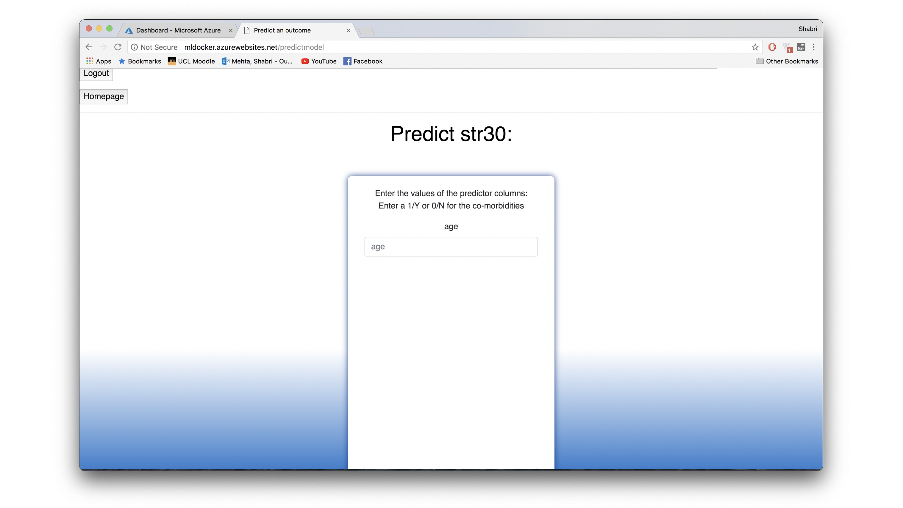

# Surgery Negative Outcome Prediction Application (2018)

This repository contains the code needed to build a machine learning application that was used to predict negative outcomes after a surgery. The application was built with the NHS. The data has not been included in this repository as it is private. 

If you would like to run the code or have any questions, please reach out. 

## Demo

The application has the following functionalities (Note, this demo has been created using dummy data):

1. An admin page where an admin can choose to upload a dataset, build a new model based on the dataset uploaded, regenerate some commonly used models (commonly used models were determined based on end user input) and run inference. There are two options to run inference, inference based on one specific model ("predict an outcome") and inference on all eight commonly used models at once ("predict general complications").

2. Once an admin uploads a dataset, some basic preprocessing occurs and we are directed to the following page. Here some summary statistics are shown for the dataset, such as the count, mean, standard deviation and min and max values. We have not shown the summary statistics in this screenshot as the dataset is private. 

3. If an admin would like to build a new model, the following page is shown. From here, the admin can list the input column numbers and the predicted column (the output column). The model is also given a name. For convenience, existing model names are shown, as well as the column names from the dataset (although the column names have not been shown here for privacy).

4. Once training is completed, the following page is shown with some metrics on the performance of the model. 

5. When running model inference on a particular model, the following page is used. Here we enter the values of the chosen input columns.

6. This page is returned with the prediction for the values of the input columns. In this use case, a patient is classified as "high" or "low" risk. 

7. An admin can also run inference on all eight commonly used models at once using the following page. (Note, the tick boxes can be used for binary variables, in this case we have not shown the variable names corresponding to the tick boxes).

8. Then, the following page shows all the predictions. 

9. Additionally, there is a surgeon profile who only has permissions to run inference. 

## Code Overview

The app is held in a Docker container, the Dockerfile and requirements.txt are for Docker. 

Dockerfile - for the docker environment

requirements.txt - the modules which are needed for the app

The app folder then contains the code for the application.

app.py - the main python file 

db.env - contains the connection string to the SQL database

__init__.py - declares folder as a package

templates - contains HTML pages

static - static files to do with styling

migrations - if the structure of the SQL datbase is changed in the code, this folder migrates the changes to the database
